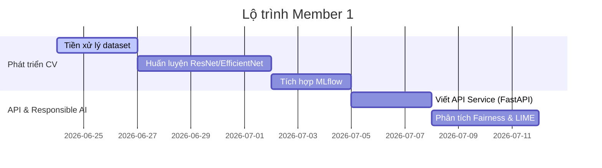
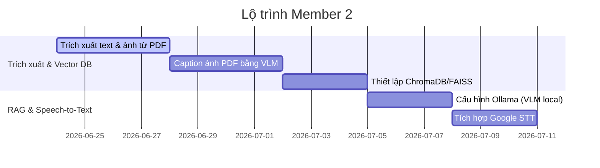
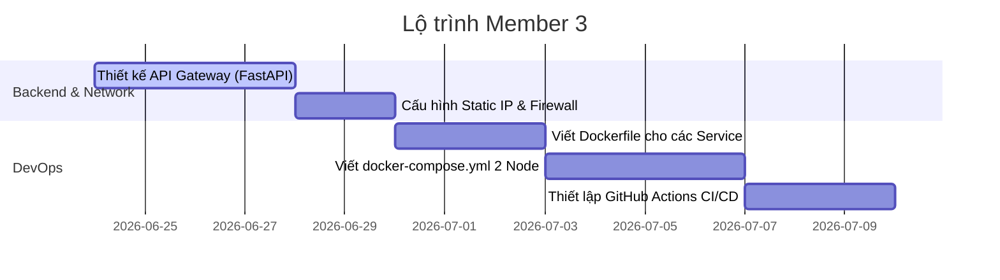
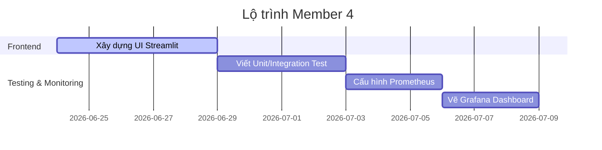

# KẾ HOẠCH TRIỂN KHAI CHI TIẾT - DỰ ÁN MULTIMODAL RAG DDM501

Kế hoạch này phân rã chi tiết các đầu việc cho **4 thành viên** theo từng giai đoạn phát triển, tích hợp và triển khai hệ thống Trợ lý ảo nhận diện xe & Tra cứu hướng dẫn sử dụng (Multimodal RAG).

---

## 1. Tổng quan các Mốc tiến độ (Milestones)

* **Giai đoạn 1: Chuẩn bị & Phát triển độc lập (Tuần 1 - Tuần 2)**
  * Các thành viên phát triển các service phụ trách dưới dạng local.
  * Thống nhất thiết kế API Interface (Request/Response JSON Schema).
* **Giai đoạn 2: Container hóa & Kiểm thử cục bộ (Tuần 3)**
  * Viết Dockerfile cho từng service.
  * Chạy thử toàn bộ các container trên một máy đơn lẻ để test luồng tích hợp.
* **Giai đoạn 3: Triển khai Phân tán & Mạng LAN (Tuần 4)**
  * Cấu hình IP tĩnh cho Node 2. Cấu hình Docker Compose trên Node 1 và Node 2.
  * Tích hợp hệ thống giám sát Prometheus/Grafana.
* **Giai đoạn 4: Đánh giá mô hình & Đóng gói (Tuần 5)**
  * Phân tích Fairness, LIME/SHAP cho mô hình CV.
  * Viết tài liệu báo cáo, vẽ sơ đồ hoàn chỉnh và chuẩn bị slide thuyết trình.

---

## 2. Kế hoạch Chi tiết cho từng Thành viên

### 2.1. Member 1: Computer Vision & Responsible AI Lead

Trọng tâm là xây dựng dịch vụ nhận diện dòng xe và phân tích độ tin cậy, tính giải thích được của mô hình AI.



#### Các đầu việc chi tiết:
1. **Tiền xử lý Dataset (Đã có sẵn)**:
   - Viết script chia tập dữ liệu (Train/Validation/Test) theo tỉ lệ 80/10/10.
   - Áp dụng các kỹ thuật Data Augmentation (xoay, lật, resize về 224x224, chuẩn hóa màu sắc) để tăng độ chuẩn xác của mô hình.
2. **Huấn luyện Mô hình CV**:
   - Sử dụng PyTorch để cài đặt kiến trúc mạng (đề xuất: **EfficientNet-B0** hoặc **ResNet-50** tiền huấn luyện - Pre-trained).
   - Huấn luyện mô hình phân loại các dòng xe có trong tập dữ liệu.
3. **MLOps với MLflow**:
   - Cài đặt và tích hợp MLflow để ghi nhận (log) các chỉ số: Learning Rate, Loss (Train/Val), Accuracy (Train/Val) qua từng epoch.
   - Lưu trữ (log artifact) file checkpoint mô hình xuất sắc nhất `.pth`.
4. **Xây dựng CV Inference Service**:
   - Viết một microservice nhỏ bằng FastAPI chạy trên Node 2.
   - Endpoint: `/predict` nhận đầu vào là file ảnh (multipart/form-data) và trả về tên dòng xe kèm độ tin cậy (Confidence score).
5. **Phân tích Responsible AI**:
   - **Fairness**: Đánh giá độ chính xác của mô hình trên các nhóm ảnh khác nhau (ví dụ: ảnh ban ngày vs. ban đêm, ảnh các góc chụp khác nhau) để đảm bảo mô hình không bị thiên lệch.
   - **Explainability**: Sử dụng thư viện **LIME** hoặc **Grad-CAM** để vẽ heatmap giải thích các vùng đặc trưng trong ảnh giúp mô hình nhận diện ra dòng xe đó. Xuất hình ảnh heatmap này về thư mục output để hiển thị lên UI Streamlit nếu người dùng yêu cầu xem giải thích.

---

### 2.2. Member 2: NLP & Multimodal RAG Pipeline Lead

Trọng tâm là xây dựng quy trình trích xuất tài liệu PDF đa phương thức, quản lý Vector DB và thiết lập mô hình VLM cục bộ.



#### Các đầu việc chi tiết:
1. **Pipeline Trích xuất PDF Đa phương thức (Multimodal Ingestion)**:
   - Viết script Python dùng PyMuPDF hoặc PDFPlumber để duyệt qua Sổ tay hướng dẫn sử dụng (PDF).
   - Tách các đoạn văn bản (Text Chunks) đồng thời phát hiện và cắt (crop) các hình ảnh, sơ đồ kỹ thuật trong PDF ra các file ảnh riêng biệt.
2. **Tạo mô tả hình ảnh (Image Captioning)**:
   - Với mỗi sơ đồ/ảnh được cắt ra từ PDF, sử dụng một mô hình VLM (chạy qua Ollama cục bộ) để tạo ra một đoạn văn tả chi tiết nội dung sơ đồ đó (ví dụ: "Sơ đồ hộp cầu chì khoang động cơ dòng xe X, cầu chì sạc điện thoại nằm ở hàng thứ 2 vị trí thứ 3...").
3. **Thiết lập Vector Database**:
   - Cài đặt **ChromaDB** hoặc **FAISS** tại Node 1.
   - Sử dụng mô hình nhúng (Text Embedding) để nhúng cả các đoạn văn bản gốc và các đoạn mô tả ảnh (captions) vào không gian vector.
   - Metadata lưu trữ của mỗi vector bao gồm: `dòng xe`, `số trang PDF`, `đường dẫn file ảnh gốc (đối với ảnh sơ đồ)`.
4. **Cấu hình VLM tại Node 2**:
   - Setup và chạy Ollama trên PC RTX 5080. Tải mô hình đa phương thức **Llama-3.2-Vision** hoặc **Llava**.
   - Thiết kế Prompt tối ưu cho mô hình VLM để sinh câu trả lời RAG dựa trên các ngữ cảnh văn bản và sơ đồ được đính kèm.
5. **Tích hợp Google Cloud Speech-to-Text**:
   - Đăng ký và cấu hình thông tin xác thực Google Cloud (Service Account JSON).
   - Viết module tiếp nhận file âm thanh `.wav` hoặc `.mp3` từ API Gateway và gửi lên Google Speech-to-Text API để chuyển đổi thành văn bản.

---

### 2.3. Member 3: Backend & DevOps Lead

Trọng tâm là phát triển cổng API Gateway điều phối, thiết lập cấu hình mạng LAN và đóng gói Docker cho toàn bộ hệ thống.



#### Các đầu việc chi tiết:
1. **Xây dựng API Gateway**:
   - Viết API Gateway chính bằng FastAPI chạy tại Node 1.
   - Endpoint: `/api/query` nhận đầu vào gồm: `image` (file ảnh xe do người dùng tải lên) và `query` (dạng text hoặc file âm thanh voice).
   - Thực hiện điều phối luồng:
     1. Gọi Module Google STT (do Member 2 viết) nếu đầu vào là voice.
     2. Gửi ảnh xe sang CV Service tại Node 2 để nhận diện dòng xe.
     3. Dùng kết quả nhận diện xe để lọc metadata (filter) và thực hiện truy vấn Vector DB tìm top K đoạn text và sơ đồ ảnh liên quan.
     4. Gửi yêu cầu tổng hợp (ảnh xe người dùng + câu hỏi + các sơ đồ ảnh và text trích xuất từ PDF) sang VLM Service tại Node 2.
     5. Trả kết quả JSON cuối cùng về cho Frontend.
2. **Cấu hình Mạng LAN Phân tán**:
   - Thiết lập địa chỉ IP tĩnh cho Node 2 (Windows PC).
   - Cấu hình Windows Defender Firewall trên Node 2 để mở port (ví dụ: port `8000` cho CV Service, port `11434` cho Ollama) cho phép Node 1 gọi API sang qua mạng LAN.
3. **Đóng gói Docker (Dockerization)**:
   - Viết Dockerfile tối ưu cho từng dịch vụ: Frontend (Streamlit), API Gateway, Vector DB, CV Service, VLM Service.
   - *Lưu ý*: Với các service AI chạy trên Node 2, Dockerfile cần sử dụng base image hỗ trợ CUDA (ví dụ: `pytorch/pytorch:2.1.0-cuda12.1-cudnn8-runtime`).
4. **Cấu hình Docker Compose đa máy**:
   - **`docker-compose.node1.yml`**: Khởi chạy Streamlit, FastAPI Gateway, ChromaDB, Prometheus, Grafana trên máy chủ Linux/Proxmox VE.
   - **`docker-compose.node2.yml`**: Khởi chạy CV Service, Ollama VLM Service trên Windows PC có GPU RTX 5080. Cấu hình Docker để nhận GPU bằng `deploy.resources.reservations.devices`.
5. **Thiết lập CI/CD GitHub Actions**:
   - Viết workflow tự động chạy kiểm thử linter (flake8/black) khi push code.
   - Tự động build Docker Image và đẩy lên Docker Hub hoặc GitHub Packages Registry khi có release.

---

### 2.4. Member 4: Frontend, QA & MLOps Lead

Trọng tâm là thiết kế giao diện người dùng, viết các kịch bản kiểm thử tích hợp và xây dựng hệ thống dashboard giám sát hiệu năng.



#### Các đầu việc chi tiết:
1. **Thiết kế Giao diện Streamlit**:
   - Thiết kế giao diện hiện đại, tối giản.
   - Widget: Upload ảnh xe, Box chat hiển thị lịch sử trò chuyện trực quan.
   - Tích hợp bộ ghi âm giọng nói (Audio Recorder) ngay trên giao diện để người dùng có thể nói trực tiếp.
   - Hiển thị kết quả: Dòng xe nhận diện được, phần giải thích LIME/Grad-CAM (nếu bật tùy chọn giải thích), câu trả lời text từ RAG và đặc biệt là khu vực hiển thị các sơ đồ/hình vẽ chỉ dẫn trích ra từ PDF.
2. **Kiểm thử Hệ thống (Testing)**:
   - Sử dụng thư viện **Pytest** để viết:
     - *Unit Tests*: Kiểm tra chức năng nhận diện của CV Service độc lập, chức năng truy vấn Vector DB, chức năng gọi STT.
     - *Integration Tests*: Giả lập gửi request (Ảnh + Voice/Text) tới API Gateway và kiểm tra phản hồi toàn trình (End-to-End).
3. **Thiết lập Hệ thống Giám sát (MLOps & Monitoring)**:
   - Cấu hình file `prometheus.yml` để thu thập dữ liệu từ API Gateway ở Node 1 định kỳ (scrape interval).
   - Định nghĩa các custom metrics trong FastAPI Gateway:
     - `http_request_duration_seconds`: Thời gian xử lý request.
     - `cv_inference_latency_seconds`: Thời gian nhận dạng ảnh xe ở Node 2.
     - `vlm_generation_latency_seconds`: Thời gian sinh câu trả lời RAG ở Node 2.
     - `error_counter_total`: Đếm tổng số request bị lỗi.
4. **Xây dựng Dashboard trên Grafana**:
   - Kết nối Grafana với nguồn dữ liệu Prometheus.
   - Thiết kế Dashboard hiển thị:
     - Tỉ lệ thành công/lỗi của request (Success Rate / Error Rate).
     - Biểu đồ thời gian phản hồi trung bình (Average Latency) và Latency ở các phân đoạn (CV vs RAG vs VLM).
     - Số lượng yêu cầu theo thời gian thực (Throughput - RPS).

---

## 3. Bản đồ Tương tác giữa các Thành viên (Collaboration Matrix)

Để hệ thống hoạt động thông suốt, các thành viên cần thống nhất các giao thức giao tiếp:

```
[UI Streamlit] (Member 4) 
      │ 
      ▼ (HTTP POST /api/query - JSON/Multipart)
[API Gateway] (Member 3) ──── (Google Speech SDK) ───► [Google STT API] (Member 2)
      │
      ├──── (HTTP POST /predict - LAN IP Node 2) ────► [CV Service] (Member 1)
      │
      ├──── (SDK Query - Localhost Node 1) ──────────► [Vector DB] (Member 2)
      │
      └──── (HTTP POST /api/generate - LAN IP Node 2) ► [Ollama VLM] (Member 2)
```

1. **Member 3 & Member 4**: Thống nhất định dạng dữ liệu đầu vào và đầu ra của `/api/query`.
2. **Member 1 & Member 3**: Thống nhất API `/predict` chạy trên Node 2.
3. **Member 2 & Member 3**: Thống nhất cấu trúc thư mục lưu trữ file ảnh sơ đồ trích xuất từ PDF để API Gateway có thể truy xuất và hiển thị lên UI.
4. **Member 3 & Member 4**: Tích hợp các metrics thu thập từ API Gateway sang Prometheus.
